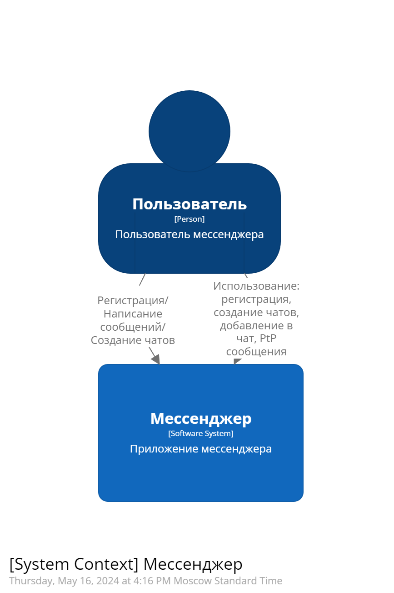

# Программная инженерия (Software Architecture)

Курсовой проект, представляющий из себя клиент-серверное приложение "Мессенджер" на основании 6-ти лабораторных работ.

## Выполнил учащийся группы М80-109М-23:

    Пешков Максим Юрьевич

## Вариант 5 - Мессенджер

Приложение должно содержать следующие данные:

- Пользователь
- Групповой чат
- Person to Person (PtP) чат
  
Реализовать API:
- Создание нового пользователя
- Поиск пользователя по логину
- Поиск пользователя по маске имя и фамилии
- Создание группового чата
- Добавление пользователя в чат
- Добавление сообщения в групповой чат
- Загрузка сообщений группового чата
- Отправка PtP сообщения пользователю
- Получение PtP списка сообщений для пользователя

# Архитектура приложения

<figure>
   
   <figcaption>Рисунок 1 - Контекстная схема приложения</figcaption>
  </figure>

<figure>
   
   <figcaption>Рисунок 2 - Структура развертки приложения</figcaption>
  </figure>

